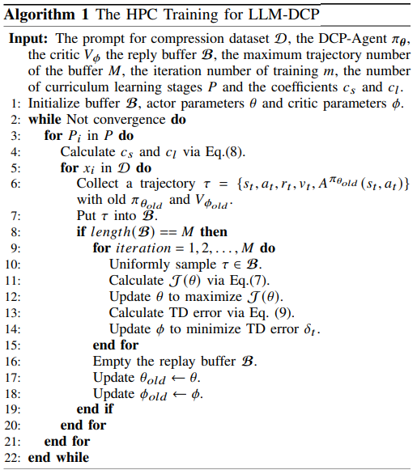

# Summer 2025 Paper Implementations

# Paper 1: SVD-LLM: Truncation-aware Singular Value Decomposition for Large Language Model Compression

**Overview and Motivation.** Leading compression techniques for LLMs are based on SVD, or Singular Value Decomposition, and avoid constraints like hardware dependency and the need for retraining. However, SVD-based techniques suffer from performance drop-offs when compression must reduce a large number of parameters. ASVD fails to directly relate singular values to the model compression loss, so truncating smaller singular values may cause great compression loss. Additionally, SVD-based compression techniques do not update remaining parameters in the compressed model to compensate for the large number of truncated parameters.

SVD-LLM is a post-training compression method that uses Truncation-Aware Data Whitening to create a direct relationship between singular values and compression loss to identify the optimal singular values to truncate to minimize loss. SVD-LLM also implements a Layer-Wise Closed-Form Model Parameter Update strategy to compressively update compressed weights one layer at a time, compensating for accuracy drop-off for models with high compression ratios.

**Novelty.** Truncation-Awareness is proposed to reduce loss, as a standard SVD compression involves truncating the smallest singular value but does not relate the singular values to compression loss. Truncation-Aware Data Whitening forces the whitening activation S-1X to be an orthogonal matrix where each channel is independent. Then, SVD is applied to WS, where W is the weight matrix of the original LLM, and the smallest singular values are truncated. Using this strategy, truncating the smallest singular value leads to the smallest loss, since the loss when one singular value is truncated equals the singular value itself. When two singular values are truncated, the loss equals the square root of the sum of their squares.

In ASVD (Activation-aware SVD), an optimization algorithm is applied to minimize ||WX - W’X||F, where W is the original weight matrix of, X is the original activation matrix, and W’ is the weight matrix of the compressed LLM. Compressing the LLM creates a new activation matrix, X’, which differs more from X as more singular values are truncated. Layer-Wise Closed-Form Update is proposed to update W’ to minimize || WX - W’X’ ||F. To optimize each layer i, the previously updated layer i-1 is used to create the activation X’i-1. To preserve the low-rank structure of W’i, matrix Ui is updated to its closed-form solution U’i, while Trunc.(Σ)i and Vi are preserved. U’i minimizes ||WiX’i-1 - W’iX’i-1||F.

**Combination with Other Compression Methods.** SVD-LLM improves the performance of quantization and parameter pruning methods. Using the GPTQ quantization method, GPTQ-4bit with SVD-LLM has an 18% lower perplexity, or measure of how a model predicts samples, than GPTQ-3bit alone and also has a smaller memory footprint (2.1 GB compared to 2.8 GB). Additionally, combining SVD-LLM with LLM-Pruner and a 30% compression ratio to compress LLaMA-7B achieves 13% lower perplexity than LLM-Prumer with a 40% compression ratio. Additionally, SVD-LLM increases token generation speed for all compression ratios.

**Results Summary.** SVD-LLM outperforms normal SVD, FWSVD, and ASVD for all compression ratios, with greater performance increases shown for higher compression ratios. SVD-LLM is also more stable across various LLM’s, avoids out of memory errors for large models, and achieves a lower perplexity for all compression ratios when combined with LoRA fine-tuning compared to ASVD + LoRA.

# Paper 2: Dynamic Compressing Prompts for Efficient Inference of Large Language Models

## Overview.
Dynamic Compressing Prompts (LLM-DCP) is a task-agnostic technique that preserves the meaning of prompts by using a Markov Decision Process (MDP) for compression. Redundancy is reduced iteratively, and tokens are sequentially removed. Hierarchical Prompt Compression (HPC) is proposed to slowly increase the compression difficulty while training a DCP-Agent.

## Motivation.
### White-box Prompt Compression
* Works at the token embedding level, changing a model’s parameters, structure, and transformer self-attention mechanism

### Black-Box Prompt Compression
#### Strengths
* Circumvents the need for source code access by working at the natural language level
#### Weaknesses
* Usually fine-tined for a specific task (like solving math problems), which makes it hard to use the same model for other tasks
* Overlook the sequential nature of prompts
* Rely on black-box LLMs for training, making them costly and impractical

## Novelty.
LLM-DPC uses a reward function to train the DCP-Agent which doesn’t need access to the LLM source code or a black-box LLM. HPC gradually increases compression difficulty to balance efficiency with information preservation. LLM-DPC follows a Markov Decision Process to mitigate losses in LLM performance.

## Advantages/Disadvantages.
### Advantages
* No need for a black-box LLM or LLM source code to train the DCP-Agent
* Uses a pre-trained small language model (SLM) since training is at token-level
* Replay buffer used to store trajectories and support multiple updates per episode.

### Disadvantages
* Reward system is prone to fluctuation during training
* Semantic compression not captured
* Compression policy is dataset/prompt-dependent (may not transfer well to other datasets)

## Implementation.
Implement Algorithm 1 from the LLM-DCP paper.

### Key Ideas
* Compression difficulty increases over time
* Critic aids the agent in learning by calculating advantage
* Weighted advantage by weight to improve training quality

# Downloading Depencies
Run pip install -r requirements.txt to install necessary libraries.
