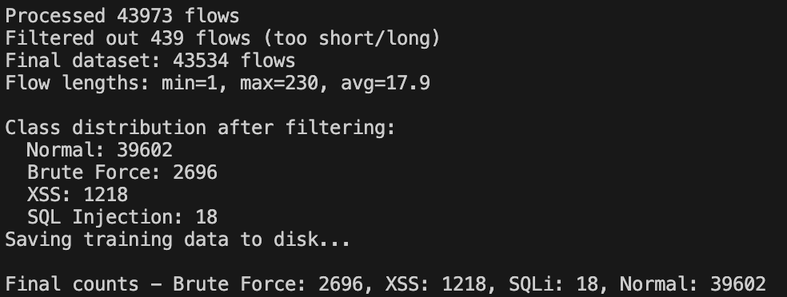
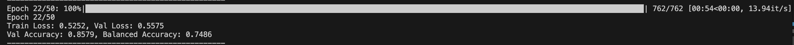

# Early Detection of Network Attacks Using Deep Learning (Paper Implementation)

## 📌 Project Summary

This repository contains an implementation of the model proposed in the paper:  
**"Early Detection of Network Attacks Using Deep Learning"**  
📄 [arXiv:2201.11628](https://arxiv.org/pdf/2201.11628)

The paper proposes a novel deep learning-based Intrusion Detection System (IDS) designed to **detect attacks early**, before they can inflict significant system damage. Unlike traditional IDS models that rely on engineered features, this system processes **raw network packet data** directly—analyzing sequences of packets with a compact and efficient neural network. It also introduces a new evaluation metric called **earliness** to quantify how quickly an attack is identified in its progression.

---

## 🎯 Motivation

Traditional Intrusion Detection Systems (IDS) often detect cyberattacks **too late**, after damage has already been done. Most approaches prioritize accuracy over **detection speed**, which is a critical flaw in time-sensitive environments. This paper targets that gap by introducing a deep learning model optimized for **early attack detection**—identifying threats **before** they escalate.

---

## 🧠 Novelty and Contributions

- ⚡ **Early Detection Objective**  
  Focuses explicitly on detecting attacks **as early as possible**, rather than simply classifying them correctly after full execution.

- 📶 **Temporal Packet Sequence Modeling**  
  Instead of relying on individual packets or static features, the model analyzes **sequences of packets** to capture evolving attack behaviors.

- ⏱️ **New Metric: Earliness**  
  Introduces a novel evaluation metric called **earliness**, which measures how far into the attack sequence detection occurs—highlighting timeliness, not just correctness.

- 🧩 **Lightweight and Deployable Architecture**  
  Implements a **compact neural network** designed to balance detection power with computational efficiency, making it suitable for real-world IDS deployment.

---

## 📈 Impact

This approach lays the groundwork for **real-time, proactive intrusion detection**, reducing potential system damage. It also reframes how IDS effectiveness is measured, placing emphasis on **when** detection happens—not just **if** it does.

---

## 🧠 Model Architecture ##

The paper introduces a lightweight **1D Convolutional Neural Network (CNN)** architecture tailored for analyzing raw packet-based network traffic.
For the implementation, I tried an LSTM

---

## 📊 Dataset

### 🗃️ CICIDS2017

- Provides realistic benign and malicious network traffic flows.
- Stratified sampling is used to preserve class distribution in train/test splits.
- The data is highly imbalanced (e.g., ~1,292x more normal flows than SQL injection).

#### 🧪 Train/Test Split (70:30) in the paper:

| Class         | Train Samples | Test Samples |
|---------------|---------------|--------------|
| Normal        | 18,990        | 8,139        |
| Brute Force   | 1,055         | 452          |
| XSS           | 456           | 196          |
| SQL Injection | 15            | 6            |

---

## 🧪 Evaluation Metrics

- **Accuracy**, **Precision**, **Recall**, **F1-score**
- **Balanced Accuracy** (primary metric used in the paper)
- **Earliness**: A custom metric measuring how *soon* an attack is detected during its progression (novel contribution)

> A perfect IDS would achieve Recall = 1.0 at FPR = 0.0 — identifying all attacks without false alarms — though this remains impractical in real-world conditions.

---

**install:** scapy, dataset (removed bc it was too large to push)

**preliminary results** 

